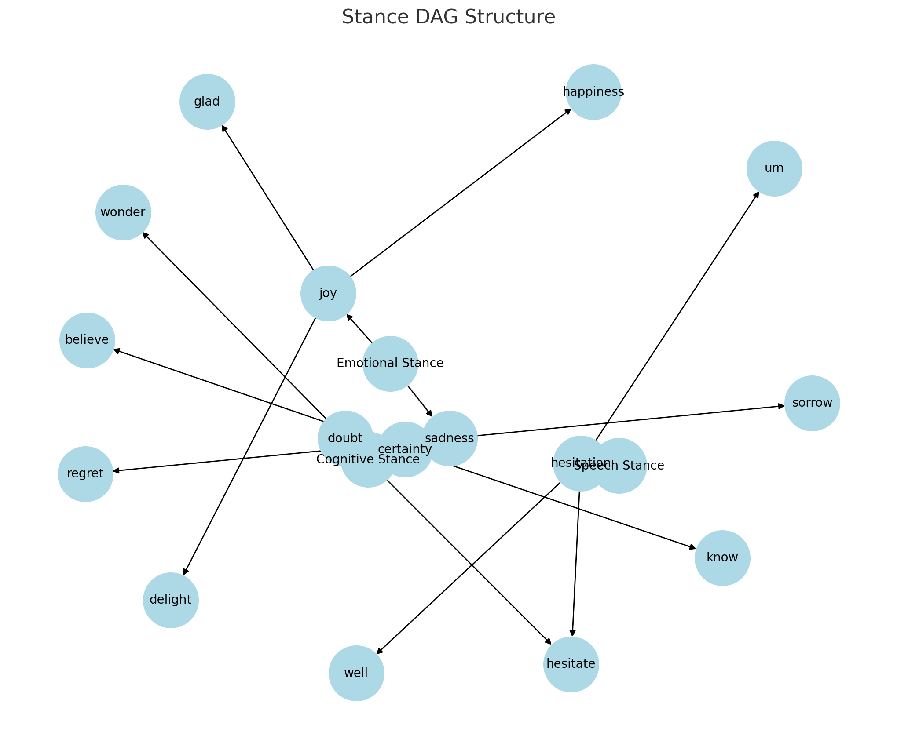

# スタンス分類におけるDAG構造の採用について

## 概要

本ドキュメントは、即時文法モデルおよびスタンス分類において、分類構造として「DAG（有向非巡回グラフ）」を正式に採用する理由と、その利点、仕様、設計指針をまとめたものである。

従来のツリー（Tree）構造では、語や意味の多義性、横断的な概念の関係、分類の柔軟な拡張が困難になるため、本モデルでは再利用可能で構造に制限の少ないDAGを採用する。

---

## DAGとは何か

**DAG（Directed Acyclic Graph）**は、

- **Directed（有向）**：矢印に方向がある（親 → 子）
- **Acyclic（非巡回）**：ぐるぐる回らない（循環しない）
- **Graph（グラフ）**：ノードとエッジで構成される構造

の3つの条件を満たした構造である。

### ツリーとの違い

| 特徴           | ツリー構造 | DAG構造（提案方式） |
| -------------- | ---------- | ------------------- |
| 各ノードの親   | 1つ        | 複数可              |
| 再利用・重複   | 不可       | 可                  |
| 分類の拡張性   | 低い       | 高い                |
| 多義性の扱い   | 困難       | 容易                |
| 表現可能な関係 | 階層のみ   | 横断・再帰も可能    |

---


図Stance DAG structure

---

## 採用理由

### 1. **語の多義性に対応できる**

- 一つの語が複数の意味（スタンス）やカテゴリに属することは自然である。
- 例："hesitate" は Cognitive（迷い）と Speech（ためらい）の両方に現れる。

### 2. **分類の拡張・再構成が容易**

- カテゴリやスタンスの追加・統合・分割を自由に行える。
- 後から分類体系を見直してもデータ破損を起こさない。

### 3. **語の再利用を自然に許容できる**

- 例："delight" は joy にも pleasure にも属せる。
- 語をノードとし、それを複数のスタンスから指せることで構造の重複が不要になる。

### 4. **命名衝突・識別子の複雑化を回避**

- "emo-joy" のような構造的命名に頼らなくても済む。
- "stance-id" を設けず、スタンス名・カテゴリ名・語の三つ組で記述すれば識別可能。

---

## 推奨仕様（データ設計）

### 構造例（JSON）

```json
{
  "stance": "joy",
  "category": "Emotional",
  "word": "delight"
}
```

このような三つ組（スタンス、カテゴリ、語）を基本単位とし、

- スタンスとカテゴリは論理的なラベルであり、
- 語（ターミナルノード）は複数回出現してよい

と定義する。

### 一意性と識別

- スタンス名、カテゴリ名、語の組み合わせ（トリプル）で識別される
- `"stance-id"` や `"word-id"` のような強制的識別子は導入しない
- 多義性や再分類を前提とする

---

## 設計指針

1. 語の重複を許容することを前提にする
2. 分類項目は編集・統合・分割可能であることを前提とする
3. 語の属するスタンスは明示的に複数定義可能とする
4. 構造に縛られない設計を行い、分類と表現の柔軟性を最大化する

---

## 今後の応用

- AEAD の意図分類（intent）との連携
- 和歌や談話の言語データへの展開
- プロセス文法モデルにおける意味・表現の対応ネットワークとしての拡張

---

## 結論

分類語彙構造において DAG を採用することは、語の多義性・意味の重なり・使用文脈の多様性を自然に記述する方法である。
「ツリーで記述するには収まらない現実の言語現象」を破綻させずに扱うために、DAGは最適な形式である。

語彙分類や意味ネットワークの構築において、DAG（有向非巡回グラフ）構造を採用している研究例が存在する。以下に代表的なものを挙げる。

---

## 1. 国立国語研究所『分類語彙表 −増補改訂版−』

国立国語研究所が提供する『分類語彙表 −増補改訂版−』は、日本語の語彙を意味によって分類・整理したシソーラス（類義語集）である。この語彙表は、語の多義性や意味の重なりを考慮し、語が複数の分類項目に属することを許容している。そのため、厳密なツリー構造ではなく、DAG構造に近い柔軟な分類体系を採用している。データベース版はCSV形式で提供され、研究開発用途に利用されている。 ([国語研コーパスポータル][1])

---

## 2. 日本語教育語彙表（JEV）

「日本語教育語彙表（JEV）」は、日本語学習者向けの語彙表で、語義や用例、類義語情報などを含んでいる。この語彙表では、語が複数の意味や用法を持つことを前提に設計されており、語と意味の関係を柔軟に記述できる構造を採用している。これにより、語彙の多義性や文脈依存性を適切に扱うことが可能となっている。 ([jreadability.net][2])

---

## 3. 「現代日本語書き言葉均衡コーパス」語彙表（BCCWJ）

「現代日本語書き言葉均衡コーパス（BCCWJ）」の語彙表では、語の使用頻度や語種、品詞構成などの情報が提供されている。この語彙表では、語が複数の分類番号を持つことがあり、多義語や語義の重なりを考慮した設計となっている。そのため、語と分類項目の関係は一対多となり、DAG構造に類似した柔軟な分類体系を実現している。 ([国語研コーパスポータル][3])

---

## 4. DAGを用いた対話感情認識モデル（DAG-ERC）

Shenら（2021）は、対話における感情認識のためのモデル「DAG-ERC（Directed Acyclic Graph Network for Conversational Emotion Recognition）」を提案している。このモデルでは、発話間の関係性をDAG構造で表現し、文脈情報を効果的に捉えることを可能にしています。実験結果からも、DAG構造が感情認識タスクにおいて有効であることが示されている。 ([arXiv][4])

---

これらの研究例は、語彙や意味の多義性、文脈依存性を適切に扱うために、DAG構造が有効であることを示している。分類語彙や意味ネットワークの構築において、DAG構造を採用することで、より柔軟で現実的な言語モデルを実現することが可能となる。

[1]: https://clrd.ninjal.ac.jp/goihyo.html?utm_source=chatgpt.com "分類語彙表－増補改訂版データベース - 国語研コーパスポータル"
[2]: https://jreadability.net/jev/?utm_source=chatgpt.com "日本語教育語彙表"
[3]: https://clrd.ninjal.ac.jp/bccwj/freq-list.html?utm_source=chatgpt.com "『現代日本語書き言葉均衡コーパス』語彙表"
[4]: https://arxiv.org/abs/2105.12907?utm_source=chatgpt.com "Directed Acyclic Graph Network for Conversational Emotion Recognition"
